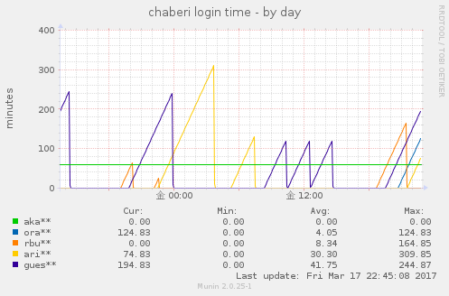

Tool Description
====



There tools are using monitoring in Chaberi.

| tool | description |
|:-----------|:-----------|
| chaberi_uptime|This tool is munin plugin.<br>Monitoring the login time of specific user.|
| chaberi_user_tw.sh|This tool is using by cron.<br>Monitoring user of specific.<br>When find the user of target , information going up by Twitter.|
| chaberi_user_tw.py|Same as above.<br>This tool is moving by python.|

Install
=====
+ chaberi_uptime
This tool into the munin plugins folder and restart the munin-node.
For details of the munin-plugins, see the [link](http://munin-monitoring.org/wiki/plugins)

+ chaberi_user_tw.sh
This tool is using tw command.
For details of the command, see the [link](http://shokai.github.io/tw/)

```
gem install tw
```

Please register this tool in crontab.
Recommended time is every 5 minutes.
```
*/5 * * * * /bin/bash /usr/local/bin/chaberi_user_tw.sh
```

License
=====
This software is released under the MIT License, see [LICENSE.](./LICENSE)